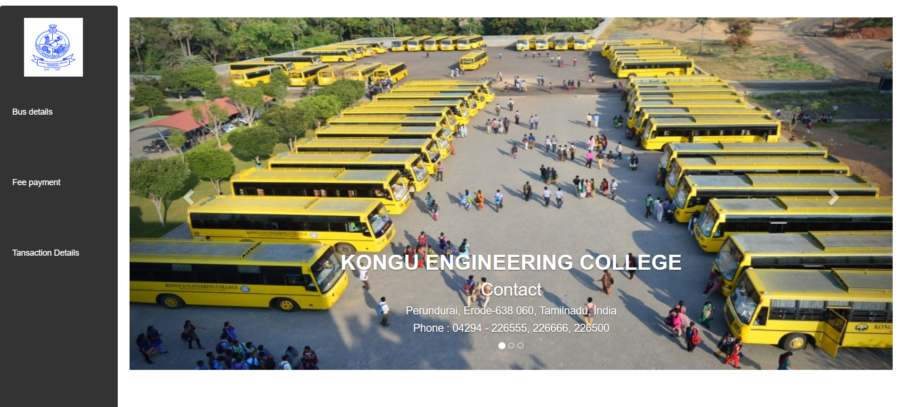
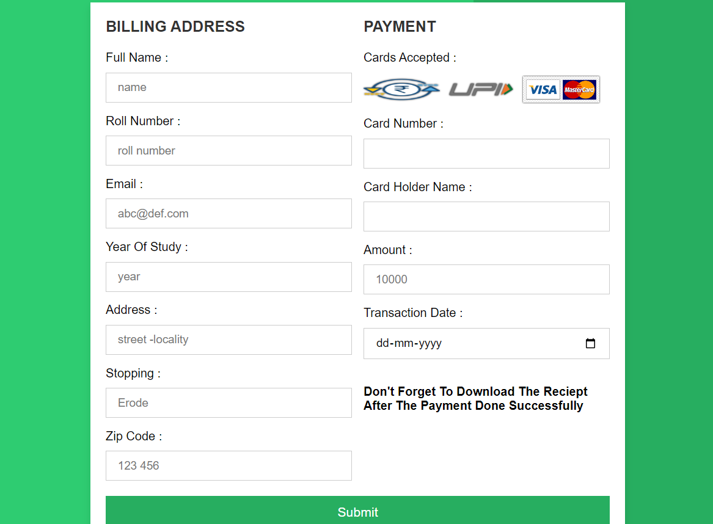
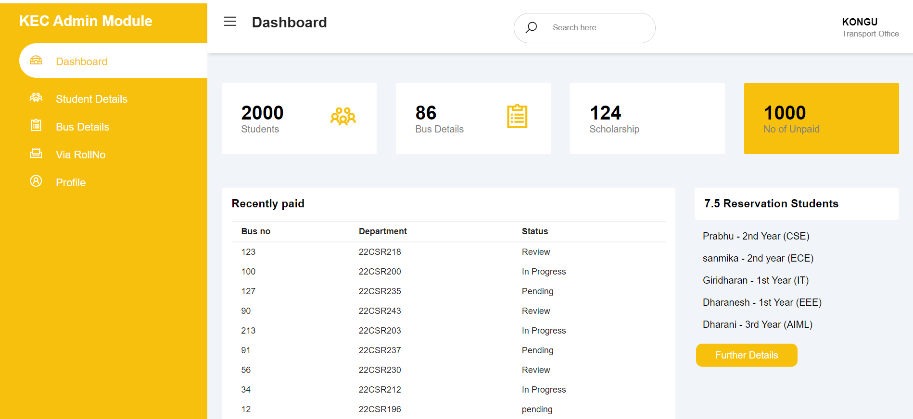

# BUS FEES MANAGEMENT

## Project Overview

  A site where students can check their transport fee and admin can track the fees of the student in regular basis.

## Features

## User Management

- **User Registration and Login**: Allow students, parents, and administrators to create accounts and log in securely.
- **Role-Based Access Control**: Different levels of access for students, parents, and administrators.

## Fees Management

- **Fees Structure Setup**: Administrators can set up different fee structures based on routes, distances, and other criteria.
- **Fee Calculation**: Automatic calculation of fees based on the selected route and other factors.
- **Scholarships**: Ability to apply scholarships to eligible students.

## Payment Management

- **Online Payment Integration**: Integrate with payment gateways (like PayPal, Stripe) to allow online fee payments.
- **Payment History**: Students and parents can view the history of payments made.

## Technology Stack

- **Frontend**: HTML , Bootstrap
- **Backend**: Node.js, Express.js
- **Database**: MongoDB


## Installation

1. **Clone the repository**
    ```sh
    git clone https://github.com/Sowmika-Arul/Bus-Fees-Management.git
    cd Bus-Fees-Management
    ```

2. **Install dependencies for the backend**
    ```sh
    cd backend
    npm install
    ```

4. **Set up environment variables**

    Create a `.env` file in the backend directory for the following content:
    ```plaintext
    PORT=5000
    MONGODB_URI=your_mongodb_connection_string
    ```

5. **Run the backend server**
    ```sh
    cd backend
    node server.js
    ```

## Usage

1. **Access the Application**
    Open your web browser and navigate to `http://localhost:5000`.

2. **Log in with appropriate credentials**
    - Admin
    - Student

## **Screenshots**

<br>

1. **Frontpage**

 <br><br>

2. **Signup and Login page**

 <br><br>

3. **Student Page**

 <br><br>

4. **Bus Details**

<br><br>

5. **Payment_Form**

<br><br>

6. **Admin page**

<br><br>

7. **Paid or Unpaid**

<br><br>
 
 8. **Database**

 <br><br>
